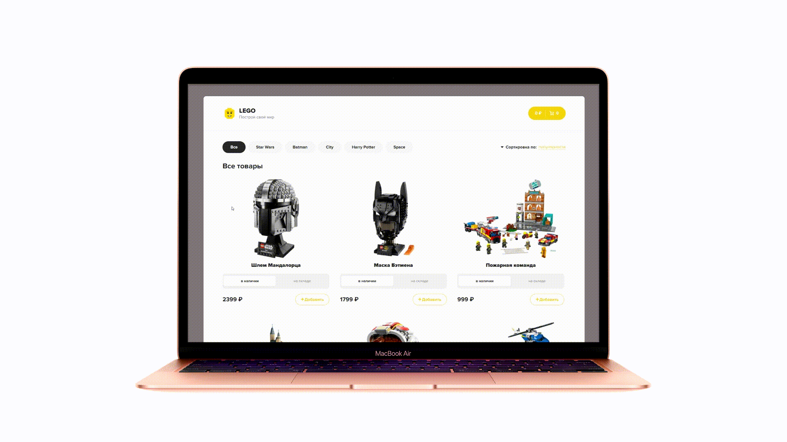

# 
Lego store

 

---

<!-- ### Description

 Design was taken from this [site.](https://ru.freepik.com)

 

The site is implemented from scratch in HTML and CSS. Also jQuery was used for navigation on the page.

---

### About the project

#### We used:
- HTML
- CSS
- JavaScript
- jQuery

We also made a responsive web design so you can use it on your phone. For navigation, we made a burger menu.

  
   

 -->

---

### How navigation works

 

