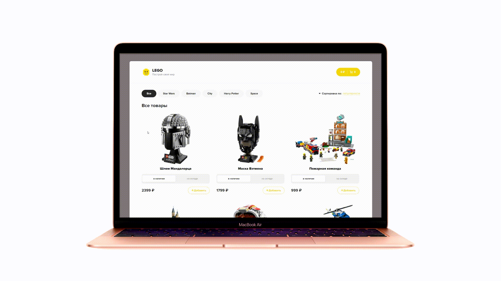
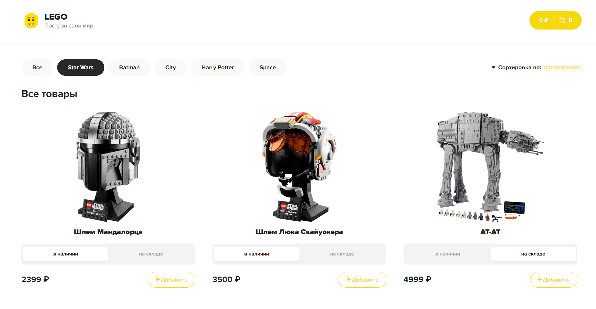
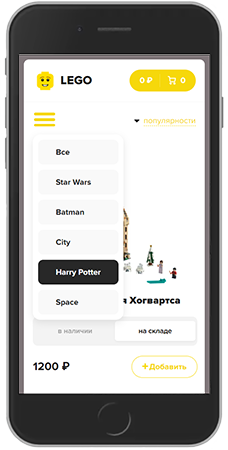
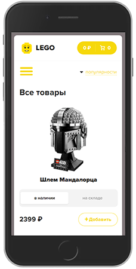

# 
Lego store

 

---

### Description

Most of the code was taken from the YouTube course [Archakov Blog](https://clck.ru/eoWVr) since we didn't have much experience with React. We didn't just copy the code, we wrote it together with the author. Also we added:
- Responsive design
- Burger menu

 

---

### About the project

#### Stack:
- React
- SCSS
- Redux
- Redux thunk
- json-server
- Axios

#### Burger menu and Responsive design:

  
   

---

### How to start 
- npm start
- npm run dev

